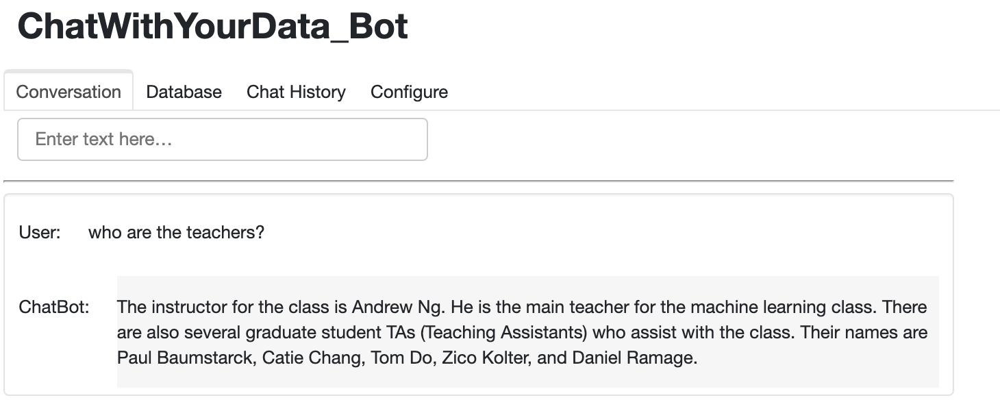
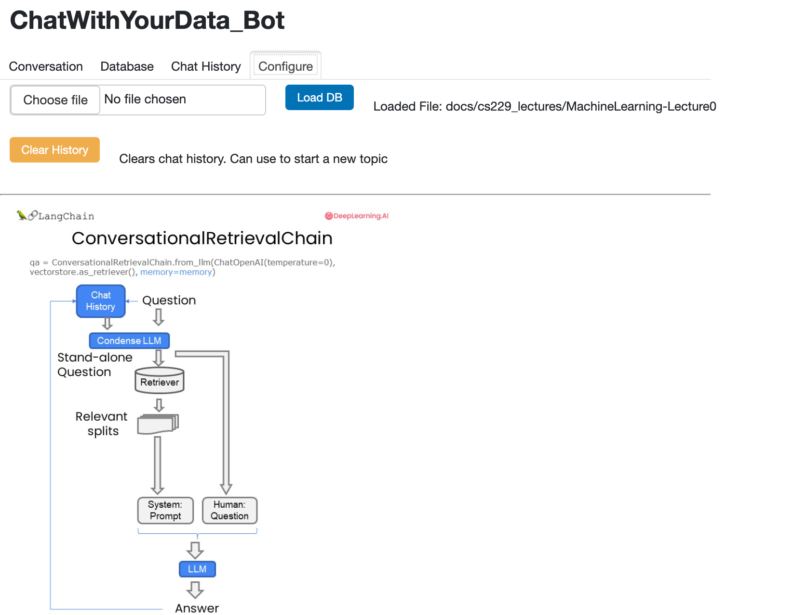

# LangChain Project - Chat with Your Data

&nbsp; 

This project is inspired by the LangChain project created by [DeepLearningAI](https://www.coursera.org/learn/langchain-chat-with-your-data-project/home/info) with 
Harrison Chase (Co-Founder and CEO - LangChain)

&nbsp; 

## 👨🏻‍💻 **About this Project**
LangChain: Chat With Your Data delves into two main topics: 
- (1) **Retrieval Augmented Generation (RAG)**, a common LLM application that retrieves contextual documents from an external dataset.
- (2) A guide to building a **Chatbot** that responds to queries based on the content of your documents, rather than the information it has learned in training.

&nbsp; 

The notebooks are organized into different sections:

1. ***Document Loading***: Learn the fundamentals of data loading and discover over 80 unique loaders LangChain provides to access diverse data sources, including audio and video.   

2. ***Document Splitting***: Discover the best practices and considerations for splitting data.  

3. ***Vector stores and embeddings***: Dive into the concept of embeddings and explore vector store integrations within LangChain.  
 
4. ***Retrieval***: Grasp advanced techniques for accessing and indexing data in the vector store, enabling you to retrieve the most relevant information beyond semantic queries.   

5. ***Question Answering***: Build a one-pass question-answering solution.   

6. ***Chat***: Learn how to track and select pertinent information from conversations and data sources, as you build your own chatbot using LangChain. Start building practical applications that allow you to interact with data using LangChain and LLMs.

    

    

&nbsp; 

&nbsp; 

## **Sources:**
- DeepLearningAI : https://www.coursera.org/learn/langchain-chat-with-your-data-project/home/info